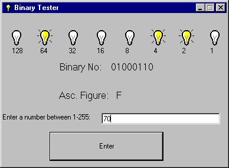



## Binary

### Description

This program lets you type in a number and via a series of light bulbs gives you the binary and also the ASC. Value.

PLEASE GIVE A COMMENT ABOUT THIS PROGRAM SO I CAN IMPROVE IT.
 
### More Info
 
Please enjoy my code but don't redo it and send it to other people.

             |
---                |---
**Submitted On**   |2000-10-07 20:22:54
**By**             |[Nick Solly](https://github.com/Planet-Source-Code/PSCIndex/blob/master/ByAuthor/nick-solly.md)
**Level**          |Intermediate
**User Rating**    |4.3 (13 globes from 3 users)
**Compatibility**  |VB 6\.0
**Category**       |[Complete Applications](https://github.com/Planet-Source-Code/PSCIndex/blob/master/ByCategory/complete-applications__1-27.md)
**World**          |[Visual Basic](https://github.com/Planet-Source-Code/PSCIndex/blob/master/ByWorld/visual-basic.md)
**Archive File**   |[CODE\_UPLOAD104971082000\.zip](https://github.com/Planet-Source-Code/nick-solly-binary__1-11944/archive/master.zip)

